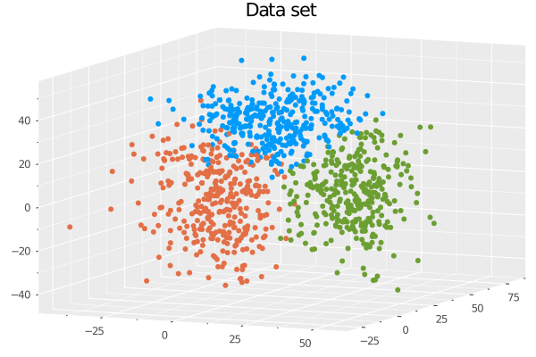
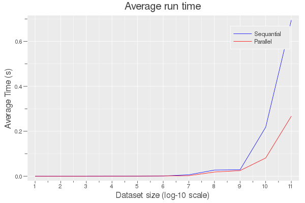
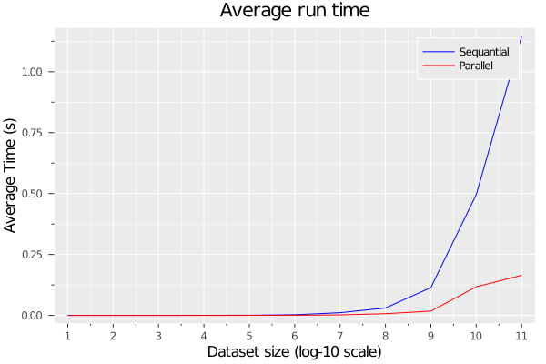
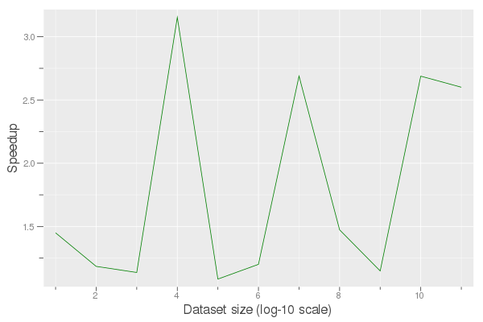

# Parallel K-Means clustering algorithm

## K-Means algorithm
1. Initialize the centers using kmeans++ algorithm
2. Assign each point to the cluster with the nearest
3. Update the clusters centers
4. Repeats step 2 and 3 until convergence

## Data set
The data set was generated from a gaussian mixture distribution.

[Clusters](data/clusters.csv) obtained by runing the sequential Kmeans clustering algorithm.



## Dependencies
- C++ compiler with c++-17 support (tested on clang)
- Make
- [Optional] Julia (DataFrames, CSV  and Plots packages)

## Building
To build run ```make```

## Results
The following results are obtained for:

- number of clusters : 3
- number of threads: 32
- number of repetitions: 30
- maximum number of iterations: 1000
- threshold : 0.1

To reproduce the results run ```./benchmark 3 32 30 1000 0.1```

#### Benchmark




#### Speedup


## Conclusion
- Used OPenMP for parallelization
- Used speedup to evaluate the performances of the parallelized kmeans algorithm
- Maximum speedup is ~7x

## References
1. T Kanungo, DM Mount, NS Netanyahu, C.D. Piatko, R. Silverman, A.Y. Wu. *An efficient k-means clustering algorithm: Analysis and implementation*, in IEEE Transactions on Pattern Analysis and Machine Intelligence, vol. 24, no. 7, pp. 881-892, July 2002.
2. Arthur, David and Sergei Vassilvitski. *k-means++: The Advantages of Careful Seeding*, 2007.
3. Barbara Chapman, Gabrielle Jost, Ruud Van Der Pas. *Using OpenMP*, 2007.
4. Joe Pitt-Francis, Jonathan Whiteley. *Guide to Scientific Computing in C++, Second Edition*, 2017.
5. [OpenMP 4.5 Reference Guide – C/C++](https://www.google.com/url?sa=t&rct=j&q=&esrc=s&source=web&cd=&ved=2ahUKEwjqnMvmhcTrAhU1t3EKHQsADNAQFjACegQIAxAB&url=https%3A%2F%2Fwww.openmp.org%2Fwp-content%2Fuploads%2FOpenMP-4.5-1115-CPP-web.pdf&usg=AOvVaw3aEsPZh5yuVEh8ZDpPeUjE)
